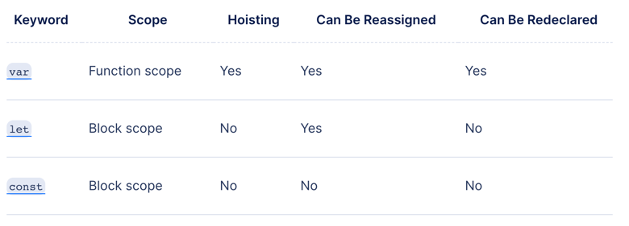

# Midterm Directions #
# Here are the prompts for the midterm. #

## Javascript Questions ##

Javascript and Front End Web Development Questions (25%)
I'm going to randomly select a few questions about Javascript and Front End Web Development from a list that I provide you all a few days before the interview (this will give you some time to become familiar with the list but probably not be able to solve them all if you haven't studied this semester.

#### Two will be selected at random for you to solve. ####

1. What is hoisting?
   The reason for this is due to hoisting, a behavior of JavaScript in which variable and function declarations are moved to the top of their scope. Since only the actual declaration is hoisted, not the initialization, the value in the first example returns undefined.
---
2. Can you explain scoping in Javascript?
##### Scope
The scope is the current context of execution in which values and expressions are "visible" or can be referenced. If a variable or expression is not in the current scope, it will not be available for use. Scopes can also be layered in a hierarchy, so that child scopes have access to parent scopes, but not vice versa.

JavaScript has the following kinds of scopes:

Global scope: The default scope for all code running in script mode.
Module scope: The scope for code running in module mode.
Function scope: The scope created with a function.
In addition, variables declared with let or const can belong to an additional scope:

Block scope: The scope created with a pair of curly braces (a block).
A function creates a scope, so that (for example) a variable defined exclusively within the function cannot be accessed from outside the function or within other functions. 
---
3. What are the differences between var, let and const?
   Keyword	       Scope	        Hoisting	Can Be Reassigned	Can Be Redeclared
     var	   Function scope	       Yes	           Yes	                Yes
     let	     Block scope	        No	           Yes	                 No
     const	     Block scope	        No	            No	                 No

---
4. Can you walk me through the mutability of data types in JS? How does that work with deep comparison?
5. Can you talk about the number of ways to write functions?
6. Can you explain how to use higher order functions in Javascript?
7. Can you explain destructuring in Javascript?

---

## Algorithms ##
Algorithm Challenges (25%)
- I'm going to randomly select a coding challenge from a list that I provide you all a few days before the interview (this will give you time to become familiar with the list but probably not be able to solve them all). You will have to solve it in pseudo code and then javascript during the meeting. You will need to 'think out loud' here. Talk me through how you would go about solving it.

#### Problem One ####

Create a function that counts how many of each letter there are in a string. This function must count both cases of the letter as the same. This should return an object.

**Example:** 

problemOne("Hello World") should return {h: 1, e: 1, l: 3, o: 2, w: 1, r: 1, d: 1}

@param {string} str - The string to be searched
@returns {number} - An object of all letter counts.

#### Problem Two ####

Create a function that finds all the uncommon elements between two arrays.

**Example:** 

problemTwo([1, 2, 3, 4, 5], [2, 4, 6, 8, 10]) should return [1,3,5,6,8,10]

@param {number[]} arr1 - The first array to be compared
@param {number[]} arr2 - The second array to be compared
@returns {number[]} - The array of common elements

#### Problem Three ####

Find the second smallest and biggest numbers in an array

**Example:** 

problemOne([1, 2, 3, 4, 5]) should return [2, 4]

@param {number[]} arr - The array to search
@returns {number[]} - An array containing the second smallest and biggest numbers in the array

#### Problem Four ####

Average the values of a grades documents. Return value with only 1 decimal place.Values can be numbers or strings. If a value is a string, ignore it. Numbers will be between 0 and 100. Handle situations where the number is not in this range.

**Example:** 

problemOne({CS230: 95, CS250: 89, CS133: 91}) should return 91.7

@param {object} obj - The object of class grades.
@returns {number}

#### Problem Five ####

Create a function that takes an array of numbers and return the three highest negative numbers in order. You must use Array operators like .forEach, .map, .filter, .reduce, etc.

**Example:** 

problemThree([-1, 2, 3, 5, 4, -4, -2, -1]) should return [-2, -1, -1]

@param {number[]} arr - The array to search
@returns {number[]} - An array containing the three lowest positive numbers in the array

---

## Project Review (50%) ##

- Walk me through one application from project 1 and where you are at with project 2.
- Walk me through the purpose of the application. I want to see that you understand the utility of a web application for a user.
- Walk me through the technical implementation. I want to see that you understand the event handling, modularity of the program and how state is maintained.
- Talk to me about the work you have left to complete. Explain to me your plan for addresses the remaining requirements.
- Talk to me about challenges.
- Those you solved and how you solved them.
- Those you still need to solve and how you plan to solve them.
- Talk to me about what you would like to add. Features, Improvements. Be critical here. What can be better.

---

## Links ##

Check out [Clément Mihailescu's YouTube Channel](https://www.youtube.com/watch?v=vHKzIPwWQkg) for a lot of mock code interviews. Here's one thats kind of enjoyable.

[Another Clement Video](https://www.youtube.com/watch?v=vHKzIPwWQkg)

This is an [interview with Dan Abramov](https://www.youtube.com/watch?v=XEt09iK8IXs) who was a founding member of the React team at Facebook and also created Redux.  

---

