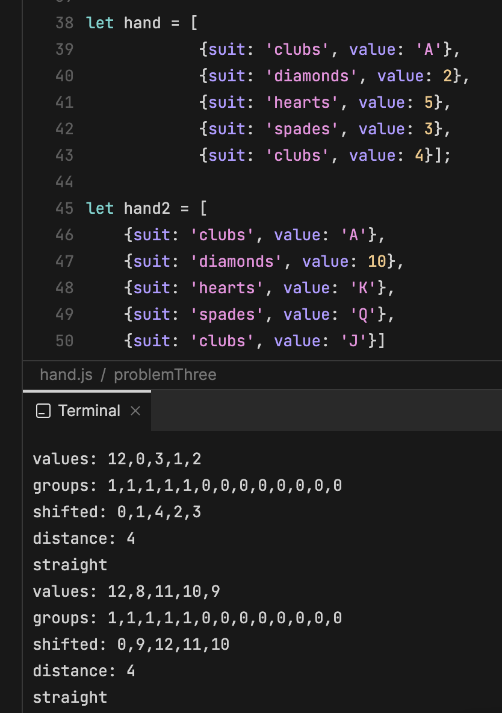

Hey everyone,

I was really frustrated with problem three and really wanted to figure out how to solve it. I tried a bunch of different things and kept running into problems with my approach. I tried moving all of the cards into a set and then doing a switch based on the sets length to figure out how many pairs or three of kinds etc there were, but this didn't work at all. I tried iterating over the values and comparing them to find pairs. I could return 'flush' when there was a flush and 'high card' for everything else. Finally Monday morning I was still caught up by this problem and decided to do some further research. I found this link that shows solutions to a very similar problem in a bunch of different languages, including javascript. The way the hand is passed as an argument, however, is as one string, like so:

"10♥ j♥ q♥ k♥ a♥"

I decided to go over the solution because I learned a lot from it, and it looks like everyone else really struggled with this problem just like I did. Here is the link to the original solution:

[Rosetta Code Poker Hand Analyser - JavaScript](https://rosettacode.org/wiki/Poker_hand_analyser#JavaScript)

Here is the solution reworked to solve problem three, I only changed a few things in how the cards are mapped and minor things within some of the other functions.

```javascript
function problemThree(hand)
 {
     const SUITS = ['clubs', 'hearts', 'spades' ,'diamonds'];
     const VALUES = [2, 3, 4, 5, 6, 7, 8, 9, 10, 'J', 'Q', 'K', 'A'];

     let values = [];
     let suits = [];

     hand.forEach(card => {
         values.push(card.value);
         suits.push(card.suit);
     });

     values = values.map(value => VALUES.indexOf(value));
     suits = suits.map(suit => SUITS.indexOf(suit));

     let flush = hand.every(card => card.suit === hand[0].suit);
     let groups = VALUES.map( (value, i) => values.filter( j => i === j ).length ).sort( (x, y) => x - y ).reverse();
     let shifted = values.map(x => (x + 1) % 13);
     let distance = Math.min( Math.max(...values) - Math.min(...values), Math.max(...shifted) - Math.min(...shifted));
     let straight = groups[0] === 1 && distance < 5;

     if (straight && flush) return 'straight flush';
     else if (groups[0] === 4) return 'four of a kind';
     else if (groups[0] === 3 && groups[1] === 2) return 'full house';
     else if (flush) return 'flush';
     else if (straight) return 'straight';
     else if (groups[0] === 3) return 'three of a kind';
     else if (groups[0] === 2 && groups[1] === 2) return 'two pair';
     else if (groups[0] === 2) return 'one pair';
     else return 'high card'

 }
```
The solution uses functional style array methods to create new arrays mapped to an array of all possible suits and values, ie the const's SUITS and VALUES at the top of the function. First the values and suits are added to new arrays and then those arrays are mapped to the SUITS and VALUES arrays using the indexOf() method. Flush is pretty self explanatory- why I was able to get it myself before. Groups is where this solution really shines. It basically creates a new array that stores how many of each value is contained within the hand dependent upon the index of the value in VALUES. Shifted solves the problem of an ace being a part of both a straight involving [A, 2, 3, 4, 5] and [10, J, Q, K, A] in a way I never could of thought up on my own.. at least not at this point in my programming career- I input both those hands, and console.log(shifted) and this is the output:



It is a really elegant solution and really shows the power of array methods like map. I was blown away by this solution and wanted to share it with you all. I feel like it made me really want to learn how to utilize these array methods. What do you guys think of this solution?